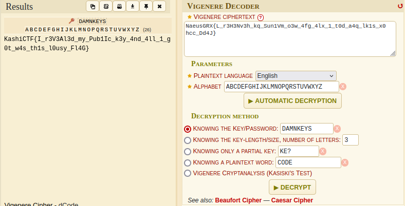

# Key Exchange [MEDIUM]

## crypto

## Author

- Argus817

## Description

Someone wants to send you a message. But they want something from you first.

Attachments: [server.py](../attachments/server.py)

## Socat server

`nc <host> 50001` 

## Flag

`KashiCTF{I_r3V3Al3d_my_Pub1Ic_K3y_4nd_4ll_1_g0t_w4s_th1s_L0usy_Fl4G}`

## Writeup

We are given a single file server.py which seems to be running on the netcat server. 

```bash
$ nc 172.17.0.3 50001

Received from Weierstrass:
   Here are the curve parameters (NIST P-384)
   p = 39402006196394479212279040100143613805079739270465446667948293404245721771496870329047266088258938001861606973112319
   a = -3
   b = 27580193559959705877849011840389048093056905856361568521428707301988689241309860865136260764883745107765439761230575
   And my Public Key: (22407850084022078988097715692934912480908268501199258251420431347278807940947243324823645559567497976549678330148492,38993202032642717735133620985339839878628080320730139981945502232657327336999270875763284168143459509641700173000813)

Send to Weierstrass:
   Public Key x-coord: ^C
```

The server uses an NIST P-384 elliptic curve. On analysis of the script, it is found that the server sends their public key `P_A` which is `n_A * G` where `n_A` is a random integer from $1$ to $p-1$ and `G` is a generator point for the curve. The server then asks the user's public key `P_B` and then uses it to create a shared secret point `S = n_A * P_B`. Hence this is entirely the Elliptic Curve Diffie Hellman Key Exchange protocol. Here `n_A` would be the server's private key.

The user can generate their own private key `n_B` which is a random integer from $1$ to $p-1$ and hence the user's public key will be `P_B = n_B * G`. The user can then send `P_B` to the server to receive the ciphertext and initialization vector. 

In order to derive the key, the shared secret `S` can be calculated by `S = n_B * P_A` and its x-coordinate can be used to derive the key using the SHA1 hashing algorithm as given in the script. Next the flag can now be decrypted.

Entire solve script is given in [solve.py](solve.py).

```bash
$ python3 solve.py
[+] Opening connection to 172.17.0.3 on port 50001: Done
b'NaeusGRX{L_r3H3Nv3h_kq_Sun1Vm_O3w_4fg_4lx_1_t0d_a4q_lk1s_X0hcc_Dd4J}\n\nHint: DamnKeys'
[*] Closed connection to 172.17.0.3 port 50001
```

The flag obtained is `NaeusGRX{L_r3H3Nv3h_kq_Sun1Vm_O3w_4fg_4lx_1_t0d_a4q_lk1s_X0hcc_Dd4J}\n\nHint: DamnKeys`. A quick cipher identification from [dcode](https://www.dcode.fr/cipher-identifier) reveals that it might be a Vigenere Cipher. The tool available can decrypt the flag using `DAMNKEYS` as the key.


