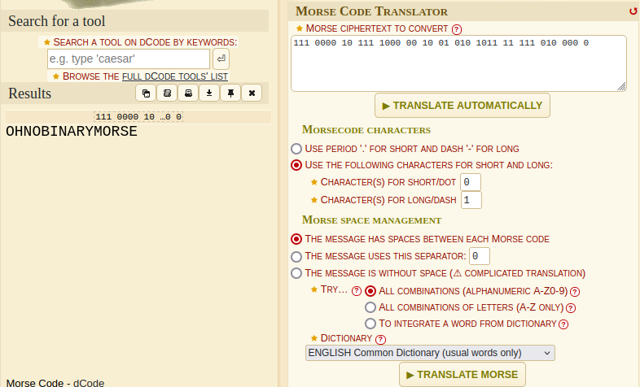

# Lost Frequencies [EASY]

## crypto

## Author

- Argus817

## Description

Zeroes, ones, dots and dashes
Data streams in bright flashes

`111 0000 10 111 1000 00 10 01 010 1011 11 111 010 000 0`

NOTE: Wrap the flag in KashiCTF{}

## Flag

`KashiCTF{OHNOBINARYMORSE}`

## Writeup

Only a short description is given in the chall with a bunch of zeroes and ones. The description clearly mentions `Zeroes, ones, dots and dashes`. Mapping zeroes to dots and ones to dashes, we get a morse code which on decryption will reveal the flag.

Tool used: [dcode](https://www.dcode.fr/morse-code)

