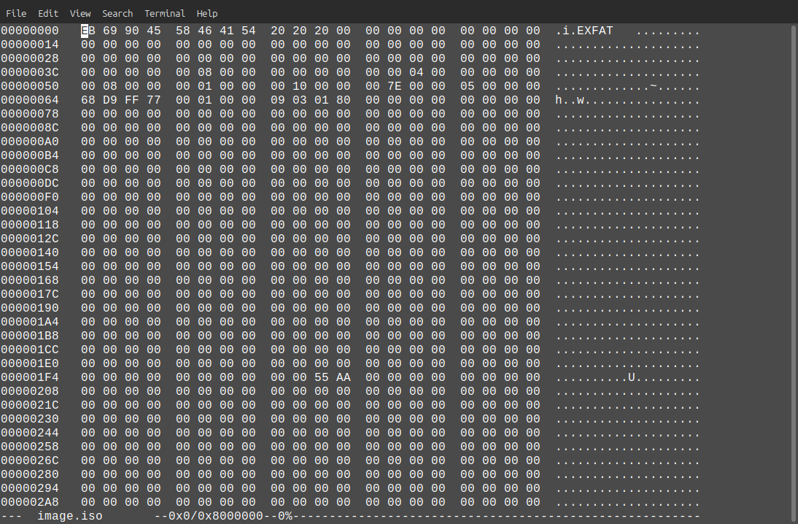

# Corruption [MEDIUM]

## forensics

## Author

- Argus817

## Description

A corrupt drive I see...

Attachments: [image.iso](https://drive.google.com/file/d/1gHY5DOmUcZvfrLr-EpQWJfR3oiVCsYtD/view?usp=sharing)

## Flag

`KashiCTF{FSCK_mE_B1T_by_b1t_Byt3_by_byT3}`

## Writeup

We are given a single image.iso file. By the extension, it seems to be a disk image. Hexedit confirms that it is an ExFAT disk image.



But on mounting the file, there seems to be a bad superblock.

```bash
$ sudo mount image.iso test 
mount: test: wrong fs type, bad option, bad superblock on /dev/loop0, missing codepage or helper program, or other error.
       dmesg(1) may have more information after failed mount system call.
```

Further investigation using `fsck` on a drive that has been written with the image gave the following output.

```bash
$ sudo dd if=image.iso of=/dev/sdb1
262144+0 records in
262144+0 records out
134217728 bytes (134 MB, 128 MiB) copied, 0.804853 s, 167 MB/s

$ sudo fsck /dev/sdb1
fsck from util-linux 2.39.3
e2fsck 1.47.0 (5-Feb-2023)
ext2fs_open2: Bad magic number in super-block
fsck.ext2: Superblock invalid, trying backup blocks...
fsck.ext2: Bad magic number in super-block while trying to open /dev/sdb1

The superblock could not be read or does not describe a valid ext2/ext3/ext4
filesystem.  If the device is valid and it really contains an ext2/ext3/ext4
filesystem (and not swap or ufs or something else), then the superblock
is corrupt, and you might try running e2fsck with an alternate superblock:
    e2fsck -b 8193 <device>
 or
    e2fsck -b 32768 <device>

Found a dos partition table in /dev/sdb1
```

Often flags can be easily found in plaintext form.

```bash
$ strings image.iso | grep KashiCTF
KashiCTF{}
KashiCTF{FSCK_mE_B1T_by_b1t_Byt3_by_byT3}
```
