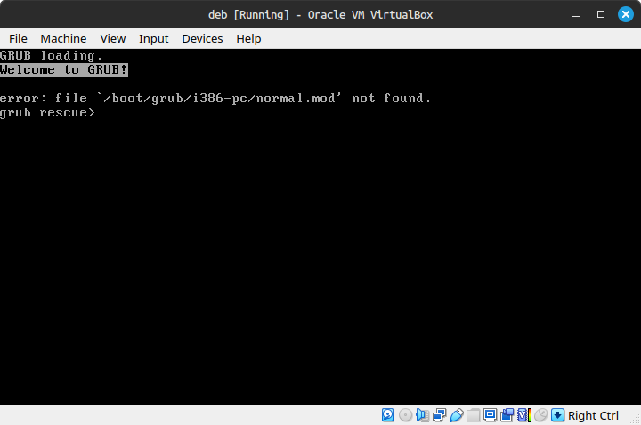

# Self Destruct [Hard]

## misc

## Author

- Argus817

## Description

The attachment is a VirtualBox image. Do not run it outside VirtualBox.

Explore the virtual machine and you might just find the flag. Or a surprise. Maybe....

VM Parameters: (VirtualBox)
Type: Linux
Version: Debian (32 bits)
RAM: 1GB
Storage: attached .vdi file

Username: kashictf  Password: kashictf

Attachments: [Self Destruct Debian.vdi](https://drive.google.com/file/d/1DFJn8cXhMBxq_NIixJo_J73Dkz9H2iSc/view?usp=drive_link) 

## Flag

`KashiCTF{rm_rf_no_preserve_root_Am_1_Right??_No_Err0rs_4ll0wed_Th0}`

## Writeup

We are given a .vdi file which is a virtualBox image. Creds are provided. On booting, a custom shell is opened. The shell is a crude implementation with very minimal features. Only catch is that the VM self destructs on any error. This means it cannot be booted again and the file needs to be redownloaded.

Users are supposed to find the flag in this mess. 

```
[/home/kashictf]
(kashictf@debian)-$ ls -la
total 28
drwx------ 2 kashictf kashictf 4096 Feb 20 20:27 .
drwxr-xr-x 3 root     root     4096 Feb 20 17:59 ..
-rw------- 1 kashictf kashictf   41 Feb 20 19:22 .bash_history
-rw-r--r-- 1 kashictf kashictf  220 Feb 20 17:59 .bash_logout
-rw-r--r-- 1 kashictf kashictf 3526 Feb 20 17:59 .bashrc
-rw-r--r-- 1 kashictf kashictf  807 Feb 20 17:59 .profile
-rw-r--r-- 1 kashictf kashictf   64 Feb 23 12:34 .sush_history

[/home/kashictf]
(kashictf@debian)-$ cat .bash_history

Broadcast message from root@debian on pts/1 (Sun 2025-02-23 23:07:01 IST):

The system will power off now!
```



Instead a `strings` command on the vdi file reveals a part of the flag.

```bash
$ strings Self\ Destruct\ Debian.vdi | grep KashiCTF
kashictf:x:1000:1000:KashiCTF,,,:/home/kashictf:/bin/bash
Value: KashiCTF
kashictf:x:1000:1000:KashiCTF,,,:/home/kashictf:/bin/bash
kashictf:x:1000:1000:KashiCTF,,,:/home/kashictf:/bin/bash
1000:1000:KashiCTF,,,
kashictf:x:1000:1000:KashiCTF,,,:/home/kashictf:/bin/bash
kashictf:x:1000:1000:KashiCTF,,,:/home/kashictf:/bin/bash
# fLaG Part 1: 'KashiCTF{r'
kashictf:x:1000:1000:KashiCTF,,,:/home/kashictf:/bin/bash
kashictf:x:1000:1000:KashiCTF,,,:/home/kashictf:/bin/sush
```

The flag is broken up into fragments.

```bash
$ strings Self\ Destruct\ Debian.vdi | grep "fLaG Part"
grep -rs "fLaG Part " /
'W(# "fLaG Part " /
echo "fLaG Part 5: 'ht??_No_Er'"
grep -rsa "fLaG Part " /
rgrep -sa "fLaG Part " /
# fLaG Part 6: 'r0rs_4ll0w'
# fLaG Part 1: 'KashiCTF{r'
# fLaG Part 4: 't_Am_1_Rig' 
echo "fLaG Part 5: 'ht??_No_Er'"
    .string    "fLaG Part 7: 'ed_Th0}'\n\nfLaG Part 2: 'm_rf_no_pr'"
fLaG Part 7: 'ed_Th0}'
fLaG Part 2: 'm_rf_no_pr'
    char *secret = "fLaG Part 7: \'ed_Th0}\'\n\nfLaG Part 2: \'m_rf_no_pr\'";
echo "fLaG Part 3: 'eserve_roo'"
fLaG Part 7: 'ed_Th0}'
fLaG Part 2: 'm_rf_no_pr'
# Kernel image management overrides fLaG Part 4: 't_Am_1_Rig'
```
